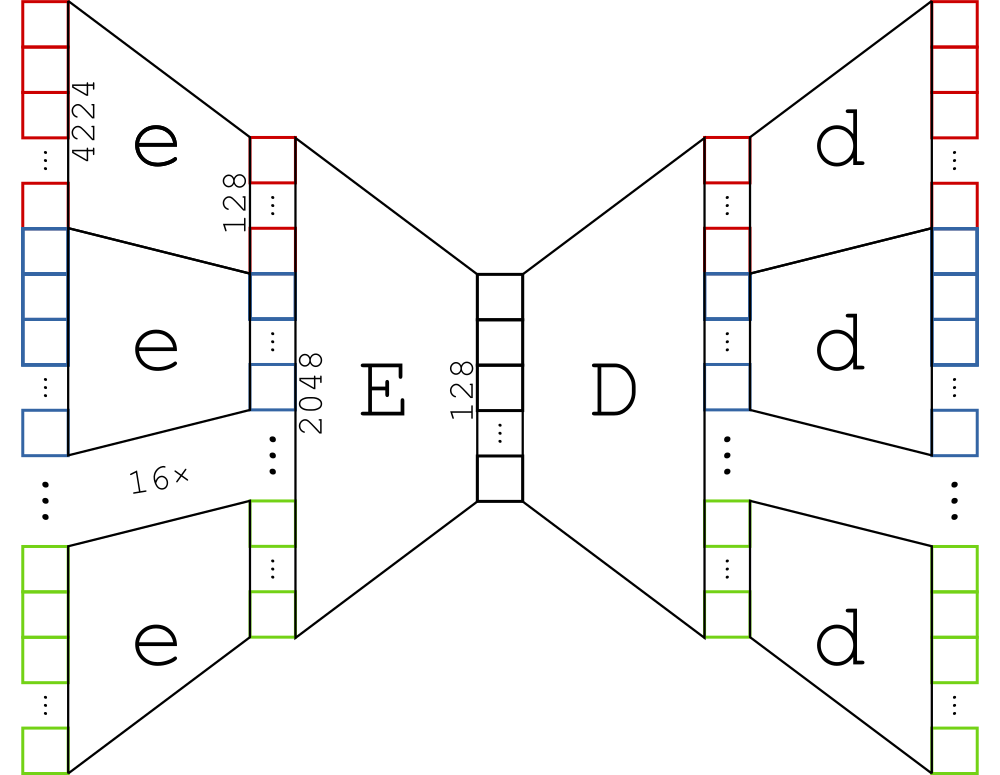

# Music generation

Final project for course *Languages and tools for programming III: Machine Learning*

#### Winter semester 2019/20

Below there is a shortened summary of the report. Complete document **in Polish** is [available as a .pdf file here.](raport.pdf)

## Concept

Main idea was to create our own model and experiment with possibilities at the intersection of Machine Learning and Music. We've settled on video game music as one of our favorite genres and possible implementations described later. As our fist big ML project however, we mostly wanted to learn about modern ML frameworks and further our knowledge about various neural network models.

Further development of the idea may create a framework for video games dynamic music systems that would change melodies depending on in-game situation: number of enemies, environment, time of the day, etc. Analogous system with different input data might even be used to add music and sounds to Silent films!

## Database

We used database of around 4000 MIDI files from [Ninsheetmusic](www.ninsheetmusic.com) page. We then converted all midi files into bitmap-like matrices (see image below). This way, we could utilize some of better-explored image-processing Machine Learning techniques.

Here we can see (a fragment of) one of the song from our database. Each column represents time unit, and each line represents sound height. Yellow columns show beginning of each tact.

## Neural network

We've experimented with four different models, each of it was based on **[Autoencoder](https://en.wikipedia.org/wiki/Autoencoder)** architecture. The general framework was always the same: simultaneously training two pairs of functions:
- encoder encoding single song tact, and its corresponding decoder (showed below as `e` and `d`)
- encoder encoding all tact feature vector into whole song feature vector, and its corresponding decoder (showed below as `E` and `D`)

The only difference in between our models was the complexity of each of the given function (We've added hidden layers, and batch normalization).

## Results and evaluation

Results were, to say the least, underwhelming. However, by the end of our exploration we've managed to generate at least some melodies that were both listenable and not a result of overfitting (i.e. it's not an approximation to any of the songs in database). We've concluded that the autoencoder architecture may be useful for generating music, but any further work would require research, experimenting with architecture, and longer training times.

Selected results (grouped by models) are available in [./export/report/songs](export/report/songs) folder. Most successful attempts stem from our last iteration (4.1.mp3 and 4.2.mp3 files).
